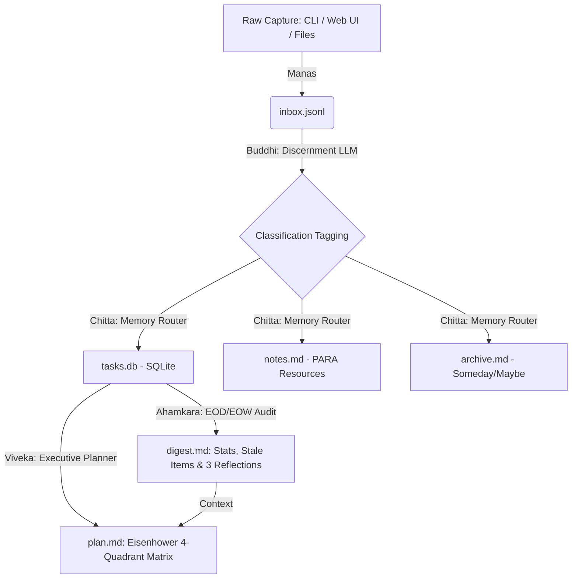

# 🧘✨ Antahkarana OS — Second Brain Multi-Agent Productivity System

> **Antahkarana** (Vedic philosophy) refers to the inner psyche or functional mind, bridging raw sensory capture with deep intellect, structured memory, self-reflective consciousness, and executive action.

Antahkarana OS is an autonomous, multi-agent personal productivity system that closes the loop between daily unstructured capture and a structured task/knowledge workflow. Instead of relying on a single monolithic LLM call, Antahkarana OS employs **5 specialized AI agent roles**—each with distinct prompts, data schemas, and responsibilities—to transform messy notes into organized **PARA** storage (Projects/Areas/Resources/Archive), insightful end-of-day/week reviews, and prioritized Eisenhower action plans.

---

## 🌟 Key Features & Architectural Philosophy

### The 5 AI Agent Roles (Antahkarana Hierarchy)
1. **📥 Manas (Capture Agent)**: The sensory capturing mind. Ingests raw notes, voice memos, and text files into `inbox.jsonl` with zero classification friction.
2. **🧠 Buddhi (Classifier Agent)**: The discerning intellect. Evaluates each inbox entry using a specialized LLM prompt to extract:
   - `type`: `task`, `idea`, `reference`, `waiting-on`, `someday`
   - `category`: Freeform PARA Project or Area (e.g., `Work/AI Project`, `Health & Wellness`, `Finance & Admin`)
   - `priority`: `high`, `med`, `low`
   - `effort`: `quick` (<15m), `focused` (1-4h), `project` (multi-day)
3. **🗄️ Chitta (Router Agent)**: The structured memory storehouse. Automatically directs classified items to their rightful PARA destination:
   - Actionable tasks (`task`, `waiting-on`) -> `tasks.db` (SQLite)
   - Resources & ideas (`reference`, `idea`) -> `notes.md` (Markdown)
   - Someday aspirations -> `archive.md` (Markdown)
4. **🪞 Ahamkara (Reviewer Agent)**: The self-reflective consciousness. Runs on demand (EOD/EOW) to analyze completion velocity, detect **Stale Tasks (>3 days untouched)**, and generate `digest.md` with 3 probing self-reflection questions.
5. **🎯 Viveka (Planner Agent)**: The executive guiding director. Evaluates open tasks against the review digest and ranks them into the **Eisenhower 4-Quadrant Matrix** (`plan.md`).

---

## 🏗️ System Data Flow & Architecture



---

## 🧠 Development Methodology: Built with Google DeepMind's Antigravity

This project was architected and developed using **Antigravity** — the advanced agentic AI coding assistant built by the **Google DeepMind** team for Advanced Agentic Coding. Rather than ad-hoc scripting, Antahkarana OS was developed following rigorous **Agentic Engineering Methodologies**:

### 1. Planning Mode & Architectural Design (`implementation_plan.md`)
Before writing code, we leveraged Antigravity's **Planning Mode** to establish strict architectural boundaries. We designed the data models, relational SQLite table definitions, and PARA routing rules upfront. This ensured our 5 cognitive agents (*Manas*, *Buddhi*, *Chitta*, *Ahamkara*, *Viveka*) could collaborate asynchronously without data collision or state corruption.

### 2. Structured Task Breakdown & Milestone Tracking (`task.md`)
We managed execution through a living, dynamic checklist (`task.md`), decomposing the multi-agent system into modular, verifiable layers:
- **Storage Layer**: Relational SQLite (`tasks.db`) and structured markdown archives (`notes.md`, `archive.md`, `digest.md`, `plan.md`).
- **LLM Client Layer**: Multi-model dynamic endpoint discovery (`v1beta`/`v1`), HTTP 429 rate-limit resilience with automatic backoff, and a deterministic keyword simulation engine for offline reliability.
- **Agent Orchestration Engine**: Building the 5 Vedic cognitive role classes and wiring them into a cohesive processing pipeline.
- **Reactive Cyberpunk Web UI**: A glassmorphism single-page web dashboard with real-time Server-Sent Events (SSE) telemetry streaming.

### 3. Verification & End-to-End Walkthroughs (`walkthrough.md`)
Every feature and edge case was validated against real-world scenarios and documented in an artifact walkthrough (`walkthrough.md`). We verified database initialization from clean slates, Windows console UTF-8 emoji compatibility, rate-limit pacing delays, and JSON cache persistence across frontend UI tab switching.

### 4. Interactive Alignment & Heuristic Refinement
Through continuous pair-programming alignment loops, we refined our AI classification heuristics—ensuring time-sensitive engineering keywords (`leak`, `release`, `bug`, `fix`, `security`, `critical`) instantly map to **Q1 (Do Now)** in the Eisenhower Matrix, while documentation and research articles automatically route to **Resources & Ideas (Notes)** to maintain task list clarity.

---

## 🚀 Quickstart & Installation

Antahkarana OS runs 100% locally with lightweight Python dependencies and zero setup friction. It supports **Google Gemini API**, **OpenAI API**, and includes an **Intelligent Simulation Mode** that guarantees a flawless 2-minute demo even offline or without API keys!

### 1. Requirements & Setup
```bash
# Navigate to project directory
cd C:\Users\nitin\.gemini\antigravity\scratch\antahkarana_os

# Install lightweight requirements
pip install -r requirements.txt
```

*(Optional)* Set your LLM API Key:
```bash
# For Google Gemini API (Recommended)
set GEMINI_API_KEY="your_api_key_here"

# Or for OpenAI API
set OPENAI_API_KEY="your_api_key_here"
```

---

## ⚡ Running the 2-Minute Automated Demo

To demonstrate the entire 5-agent pipeline (capture → classify → route → review → plan) from terminal in under 2 minutes:

```bash
python cli.py demo
```

**What happens during the demo?**
1. **Seeding (Manas)**: Pre-populates 10 realistic sample entries across Work, Health, Finance, and Home.
2. **Time-Warping**: Intentionally sets creation dates on 3 open tasks to **4–6 days in the past**.
3. **AI Processing (Buddhi & Chitta)**: Classifies and routes items into SQLite and Markdown stores.
4. **Stale Item Audit (Ahamkara)**: Instantly flags the 3 aged tasks as **"⚠️ STALE (>3 Days Untouched)"** and outputs 3 AI self-reflection questions.
5. **Executive Planning (Viveka)**: Allocates open tasks into the Eisenhower Matrix.

---

## 🖥️ Launching the Cyber-Vedic Single-Page Web UI

Antahkarana OS includes a breathtaking, reactive Web UI featuring deep dark-mode glassmorphism, glowing Kanban tables, Eisenhower matrix grids, and a real-time **Agent Telemetry Console** powered by Server-Sent Events (SSE).

```bash
python cli.py serve
```
Open your browser to: **http://localhost:8000**

### UI Highlights:
- **⚡ Quick Capture & File Dropzone**: Add notes or drag-and-drop text files.
- **🧠 Visual AI Pipeline**: Interactive progress badges showing items moving from Inbox to PARA storage.
- **📁 Actionable Task Table**: Checkbox completion, PARA category tags, Priority badges, and pulsing red **STALE** alerts.
- **🎯 Eisenhower Matrix Grid**: Responsive 2x2 cards showing Do Now, Schedule, Delegate, and Eliminate items.
- **📡 Live Telemetry Terminal**: Cyberpunk log console streaming exact prompt payloads, token estimates, and agent reasoning.

---

## 🛠️ CLI Reference

```bash
# Capture a raw note
python cli.py capture "Schedule annual medical checkup for next week"

# Capture multiple entries from a text file
python cli.py capture -f my_notes.txt

# Trigger individual agents
python cli.py classify
python cli.py route
python cli.py review
python cli.py plan

# Reset and seed sample demo data
python cli.py seed

# Wipe all tasks.db and archive data for a completely clean slate
python cli.py clean
```

---

## 🧹 Cleaning & Resetting Storage (Database Maintenance)

If you need to clear old data from SQLite (`tasks.db`) and markdown archives to start with a completely clean slate, choose any of these three methods:

1. **CLI Command (Recommended)**:
   ```bash
   python cli.py clean   # Or: python cli.py reset
   ```
2. **API Endpoint**: Send a `POST` request to `http://localhost:8000/api/trigger/clean`.
3. **Manual Deletion**: Delete the `./data/tasks.db` file or `./data/` directory. Antahkarana OS will automatically generate fresh, empty storage files on next run!

