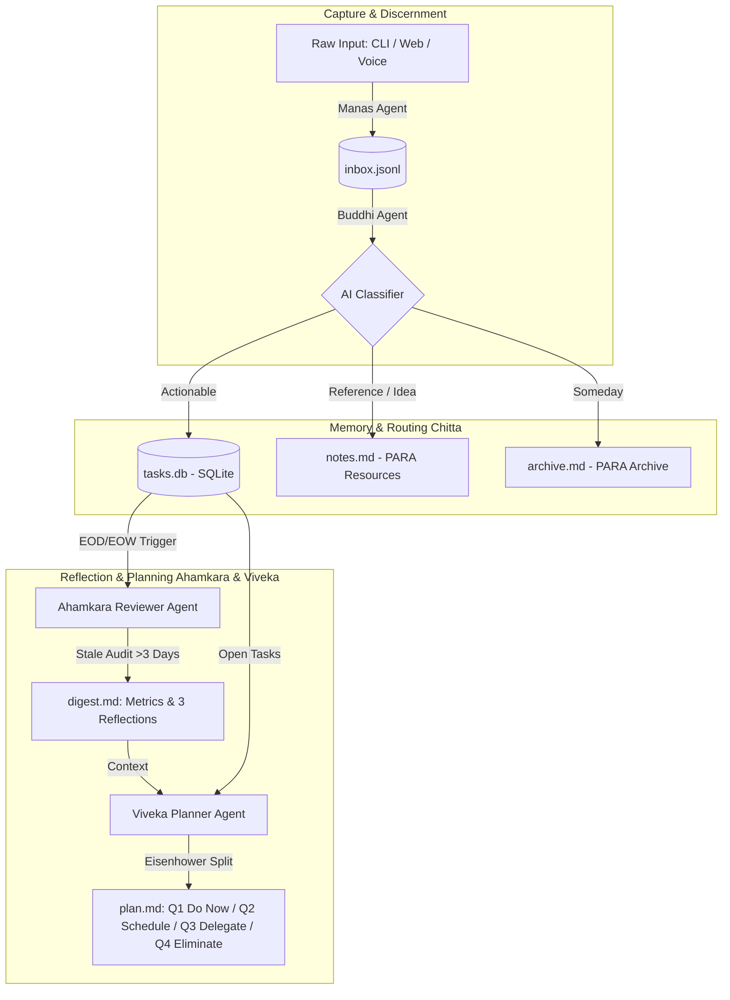

# Closing the Productivity Loop: Why Unstructured Capture Needs Multi-Agent AI (Antahkarana OS)

*A Technical Deep-Dive into Building a Local, Multi-Agent "Second Brain" with Python, SQLite, and PARA Architecture.*

---

## 1. The Broken Promise of Daily Capture

We live in a golden age of note-taking tools, yet personal productivity remains a crisis of cognitive overload. Why? Because the fundamental mechanics of human memory are dualistic: **capturing** requires zero friction, while **organizing** requires high cognitive friction.

When we force ourselves to categorize, tag, and prioritize notes at the moment of capture, we interrupt our flow state and often abandon note-taking entirely. Conversely, when we dump unstructured thoughts into a digital scratchpad without structured processing, our notes decay into a digital graveyard of forgotten tasks and dead links.

To solve this, we need a system that decouples sensory capture from intellectual categorization and executive planning. Rather than attempting to solve this with a single, monolithic LLM prompt—which often hallucinates, mixes concerns, and fails to maintain consistent schemas—we built **Antahkarana OS**: an autonomous multi-agent productivity system.

---

## 2. Drawing Inspiration from Vedic Philosophy

In Vedic philosophy, **Antahkarana** refers to the inner psyche or functional mind. It is not a single entity, but an integrated hierarchy of four specialized cognitive layers:

1. **Manas (The Sensory Mind)**: Receives raw sensory impressions from the outside world without judgment or classification.
2. **Buddhi (The Intellect)**: Analyzes, discerns, categorizes, and applies logic to raw impressions.
3. **Chitta (The Memory Storehouse)**: Organizes and preserves structured knowledge and experiences over time.
4. **Ahamkara (The Ego / Consciousness)**: Self-reflects, evaluates progress against personal identity, and generates awareness.

To these four, we add a fifth guiding executive principle: **Viveka (Discernment & Strategic Direction)**, which prioritizes actions based on ultimate value.

By mapping these five principles directly to autonomous AI agent roles, we create a resilient, self-organizing digital second brain.

---

## 3. Architecture of Antahkarana OS

Antahkarana OS is built as a lightweight, local-first Python application utilizing **FastAPI**, **SQLite**, **JSON Lines**, and **Markdown**, paired with a reactive HTML/Vanilla CSS/JS frontend.

### The 5 Agent Responsibilities:
1. **Manas (Capture Agent)**: Appends `{id, text, timestamp, source}` entries to `inbox.jsonl`. It can also parse bulk raw `.txt` or `.md` files. Zero LLM latency or classification overhead is incurred here.
2. **Buddhi (Classifier Agent)**: Reads unprocessed inbox items and invokes an LLM with a specialized prompt to extract five structured attributes: `type` (task/idea/reference/waiting-on/someday), `category` (freeform PARA project/area), `priority` (high/med/low), `effort` (quick/focused/project), and a 1-sentence `reasoning` log.
3. **Chitta (Router Agent)**: Validates classified objects and executes atomic routing into structured storage:
   - **Actionable Tasks**: Inserted into `tasks.db` (SQLite) with schema-enforced status tracking (`open`, `completed`, `stale`).
   - **Informational References & Ideas**: Appended to `notes.md` under Markdown headings grouped by Project/Area.
   - **Someday Aspirations**: Saved to `archive.md`.
   Once successfully stored, items are purged from `inbox.jsonl`.
4. **Ahamkara (Reviewer Agent)**: Triggered during end-of-day (EOD) or end-of-week (EOW) reviews. It computes completion velocity and performs an automated audit across `tasks.db` to identify **Stale Tasks**—items remaining open for more than 3 days untouched. It then prompts the LLM with these exact bottlenecks to generate 3 deep, personalized reflection questions saved to `digest.md`.
5. **Viveka (Planner Agent)**: Reads open tasks and the review digest, invoking the LLM to allocate every task into the **Eisenhower 4-Quadrant Matrix** (`plan.md`):
   - **Q1 (Do Now)**: Urgent & Important (crises, deadlines, high-impact fixes).
   - **Q2 (Schedule)**: Important, Not Urgent (deep architecture, strategic planning).
   - **Q3 (Delegate / Quick Wins)**: Urgent, Not Important (batchable admin chores).
   - **Q4 (Eliminate)**: Neither (low ROI activities to abandon).

---

## 4. Key Engineering Takeaways

### Why Hybrid Storage Beats Pure Database or Pure Markdown
In personal productivity, different data types demand different storage paradigms:
- **Daily Capture** requires append-only speed without lock contention -> **JSON Lines (`inbox.jsonl`)**.
- **Actionable Tasks** require relational querying, status mutations, and date filtering -> **SQLite (`tasks.db`)**.
- **Long-term Knowledge & Notes** require human readability, portable formatting, and semantic search -> **Markdown (`notes.md`, `archive.md`)**.

Antahkarana OS combines all three into a unified PARA hierarchy managed seamlessly by our Router Agent.

### Real-Time Telemetry via Server-Sent Events (SSE)
To make multi-agent execution transparent and trustworthy, we built an event broadcasting system in our unified LLM wrapper (`llm_client.py`). Every agent thought, LLM API call, latency metric, and JSON payload is pushed to a Server-Sent Events endpoint (`/api/logs/stream`), rendering live inside our Web UI's cyberpunk terminal console.

---

## 5. Conclusion: Towards Autonomous Personal OS

By decomposing personal productivity into five specialized cognitive roles, Antahkarana OS demonstrates how multi-agent AI architectures can solve complex, multi-stage workflows that single prompt calls cannot. It removes the cognitive burden of organization while preserving human agency, executive decision-making, and self-reflection.
